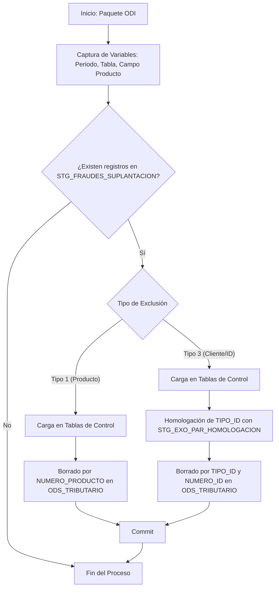

# Informe Técnico: Proceso de Eliminación de Fraudes y Suplantación - ODI 12c

## 1. Introducción
Este documento describe el proceso técnico implementado en Oracle Data Integrator (ODI) 12c para la eliminación de registros asociados a Fraudes y Suplantación en los reportes de Información Exógena.

## 2. Objetivos
El principal objetivo del proceso es garantizar la depuración de la información que se reportará a la DIAN, eliminando aquellos registros que han sido identificados como fraudulentos o suplantaciones de identidad, basándose en la información proporcionada por las áreas de negocio correspondientes.

## 3. Arquitectura del Proceso
El proceso está compuesto por:
- **Tablas de Staging:** Donde se carga la información de fraudes a excluir.
- **Tablas de Control:** Repositorio histórico de registros eliminados.
- **Procedimiento de Eliminación:** Un procedimiento centralizado que ejecuta las sentencias DELETE.
- **Paquetes ODI:** Diferentes paquetes que orquestan la eliminación para cada área funcional.

### 3.1. Diagrama de Flujo del Proceso

## 4. Control de Eliminados (Trazabilidad)
Como medida de seguridad y auditoría, el proceso implementa un control de registros eliminados. Antes de proceder con el borrado físico en las tablas del ODS, los registros identificados son respaldados en tablas de control específicas.

### 4.1. Tablas de Control
Dependiendo del tipo de producto o área funcional, los registros se cargan en una de las siguientes tablas:
- **`ODS_TRIBUTARIO.ELIMINADOS_FRAUDES_ACTIVO`**: Utilizada para la mayoría de los procesos (Ajustes, Comisiones, Compras, Desembolsos, Ingresos Otros).
- **`ODS_TRIBUTARIO.ELIMINADOS_FRAUDES_PASIVO`**: Utilizada específicamente para el proceso de Cuentas Exógena.

### 4.2. Flujo de Control en ODI
Dentro de los paquetes ODI, se ejecutan mapeos previos al escenario de eliminación:
1.  **Eliminados Tipo Exclusión 1:** Mapeo que inserta en la tabla de control los registros que coinciden por producto.
2.  **Eliminados Tipo Exclusión 3:** Mapeo que inserta en la tabla de control los registros que coinciden por identificación (previo paso por homologación).

Este mecanismo garantiza que cualquier registro eliminado del ODS pueda ser consultado posteriormente para fines de auditoría o aclaraciones.

## 5. Modelo de Datos
### 5.1. Tablas de Origen (Control de Fraudes)
- **`STG_TRIBUTARIO.STG_FRAUDES_SUPLANTACION`**: Contiene el listado de productos e identificaciones a excluir.
  - `TIPO_EXCLUSION`: Indica si la exclusión es por producto (1) o por identificación (3).
  - `NUMERO_PRODUCTO`: Número de cuenta o negocio a excluir (para tipo 1).
  - `TIPO_ID` / `NUMERO_ID`: Identificación del cliente a excluir (para tipo 3).
  - `NOMBRE_TABLA`: Nombre de la tabla destino de donde se debe eliminar el registro.
- **`STG_TRIBUTARIO.STG_EXO_PAR_HOMOLOGACION`**: Utilizada para homologar los tipos de identificación entre el sistema origen (Davivienda) y el destino (DIAN).

### 5.2. Tablas de Destino (ODS_TRIBUTARIO)
El proceso afecta a varias tablas en el esquema `ODS_TRIBUTARIO`, incluyendo:
- `AJUSTES_COMISIONES_TERCEROS`
- `AJUSTES_COMPRAS_TC`
- `AJUSTES_DESEM_EXOGENA`
- `AJUSTES_INGRESOS_OTROS`
- `COMISIONES_TERCEROS_EXOGENA`
- `COMPRAS_TC_EXOGENA`
- `CUENTAS_EXOGENA`
- `DESEMBOLSOS_EXOGENA`
- `INGRESOS_OTROS_EXOGENA`

## 6. Lógica de Eliminación
El procedimiento centralizado `PRC_ELIMINA_FRAUDES_SUPLANTACION_V2` utiliza una sentencia `DELETE` con una cláusula `EXISTS` para identificar los registros a eliminar basándose en dos criterios:

### 6.1. Exclusión Tipo 1 (Por Producto)
Se eliminan registros cuyo número de producto coincida con el registrado en la tabla de fraudes para la tabla y periodo específicos.
- **Campo de comparación:** Dinámico (definido por `#GENERACION_REPORTE_EXOGENA.VAR_CAMPO_PRODUCTO`).

### 6.2. Exclusión Tipo 3 (Por Cliente / Identificación)
Se eliminan registros basados en el tipo y número de identificación (equivalente a exclusión por cliente). Dado que los tipos de identificación pueden diferir entre sistemas, se utiliza una tabla de homologación.
- **Condiciones:**
  - El `TIPO_ID` se homologa usando el grupo 'TIPO IDENTIFICACION' y origen 'CLIENTE360'.
  - Se valida tanto el código DIAN en el destino como el código Davivienda en el origen de fraudes.

## 7. Implementación en ODI 12c
### 7.1. Paquetes (Packages)
Cada paquete sigue un flujo estándar:
1.  **Captura de Parámetros:** Se asignan valores a variables como `#GLOBAL.VAR_PERIODO`, `#GLOBAL.VAR_TABLA` y `#GENERACION_REPORTE_EXOGENA.VAR_CAMPO_PRODUCTO`.
2.  **Registro de Eliminados:** Pasos para identificar o registrar los registros que serán eliminados antes de proceder con el borrado físico.
3.  **Ejecución de Eliminación:** Llamada al escenario `CASO_ELIMINA_FRAUDES_SUPLANTACION_V2` pasando las variables capturadas.

### 7.2. Mapeo de Variables por Proceso
| Paquete ODI | Tabla Destino (`VAR_TABLA`) | Campo Producto |
| :--- | :--- | :--- |
| `PAQ_EXO_LD_FRAUDES_AJUSTES_COMISIONES` | `AJUSTES_COMISIONES_TERCEROS` | `NUMERO_NEGOCIO` |
| `PAQ_EXO_LD_FRAUDES_AJUSTES_COMPRAS` | `AJUSTES_COMPRAS_TC` | `NUMERO_NEGOCIO` |
| `PAQ_EXO_LD_FRAUDES_AJUSTES_DESEMBOLSOS` | `AJUSTES_DESEM_EXOGENA` | `NUMERO_NEGOCIO` |
| `PAQ_EXO_LD_FRAUDES_AJUSTES_INGRESOS` | `AJUSTES_INGRESOS_OTROS` | `NUMERO_NEGOCIO` |
| `PAQ_EXO_LD_FRAUDES_COMISIONES_TERCEROS` | `COMISIONES_TERCEROS_EXOGENA` | `NUMERO_NEGOCIO` |
| `PAQ_EXO_LD_FRAUDES_COMPRAS_TC_EXOGENA` | `COMPRAS_TC_EXOGENA` | `NUMERO_NEGOCIO` |
| `PAQ_EXO_LD_FRAUDES_CUENTAS_EXOGENA` | `CUENTAS_EXOGENA` | `NUM_CUENTA` |
| `PAQ_EXO_LD_FRAUDES_DESEMBOLSOS_EXOGENA` | `DESEMBOLSOS_EXOGENA` | `NUMERO_NEGOCIO` |
| `PAQ_EXO_LD_FRAUDES_INGRESOS_OTROS` | `INGRESOS_OTROS_EXOGENA` | `NUMERO_NEGOCIO` |

## 8. Conclusiones
La implementación actual en ODI 12c permite un manejo centralizado y parametrizado de las exclusiones por fraude y suplantación, facilitando el mantenimiento y asegurando la integridad de los reportes enviados a los entes reguladores.
